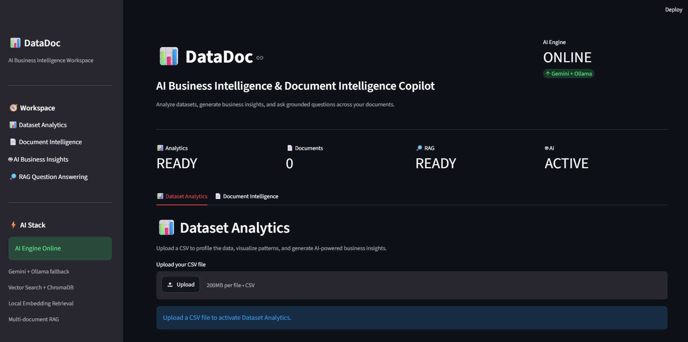
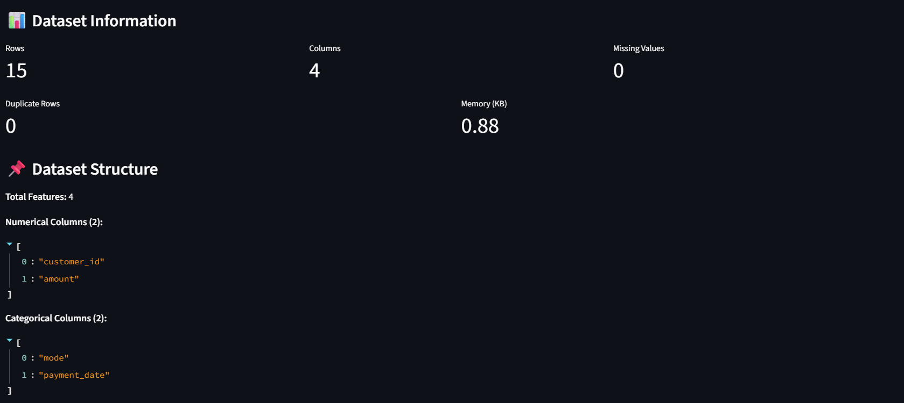
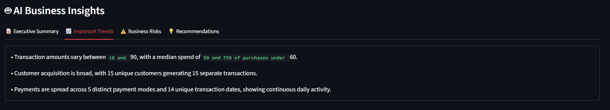
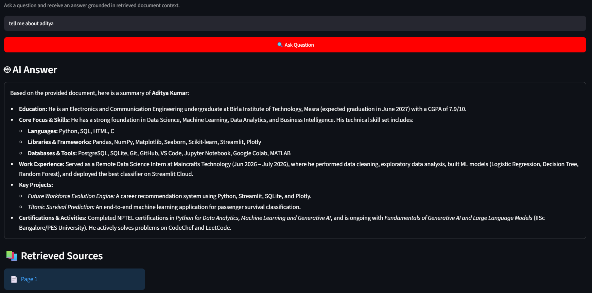

# 📊 DataDoc

### AI Business Intelligence & Document Intelligence Copilot

DataDoc is an AI-powered **Business Intelligence and Document Intelligence platform** built with Streamlit. It combines structured dataset analysis, AI-generated business insights, PDF document processing, semantic search, and Retrieval-Augmented Generation (RAG) into a single interactive workspace.

## 🚀 Live Demo

🌐 **Live Application:** https://datadoc-ai-copilot.streamlit.app

📦 **GitHub Repository:** https://github.com/adityakumar45127/DataDoc

> 💡 DataDoc is deployed on Streamlit Community Cloud and supports both CSV-based business analysis and PDF-based document question answering.

## ✨ Features

- 📊 **Dataset Analytics** — Upload CSV files, inspect dataset structure, analyze numerical and categorical features, identify missing values and duplicates, generate statistical summaries, and explore data through visualizations.

- 🤖 **AI Business Insights** — Automatically generate an executive summary, important trends, business risks, and actionable recommendations from uploaded datasets.

- 📄 **PDF Document Intelligence** — Upload PDF documents, extract their content, split documents into meaningful chunks, generate embeddings, and store them in a vector database.

- 🔎 **RAG Question Answering** — Ask questions about uploaded documents and receive context-grounded answers with relevant page-level sources.

- 🧠 **Multi-LLM Fallback Architecture** — Uses Google Gemini as the primary cloud LLM, Groq as the cloud fallback provider, and Ollama as a local fallback for development and local execution.

- ⚡ **Smart AI Caching** — Uses SHA-256 file identification and Streamlit session state to prevent unnecessary re-analysis of the same CSV during application reruns.

- 📚 **Multi-Document Support** — Process and query uploaded PDF documents independently.

- 🧩 **Structured AI Output** — Uses Pydantic schemas to produce consistent and structured business insight responses.

- ☁️ **Cloud Deployment** — Deployed using Streamlit Community Cloud for accessible browser-based demonstrations.

## 📸 Screenshots

### 🖥️ DataDoc Dashboard

### 📊 Dataset Analytics

### 🤖 AI Business Insights

### 🔎 RAG Document Question Answering

## 🏗️ Architecture

<pre>
                           📊 DataDoc
                              │
                    ┌─────────┴─────────┐
                    │                   │
                    ▼                   ▼
             📊 CSV Analytics      📄 PDF Intelligence
                    │                   │
                    ▼                   ▼
             Dataset Profiling    Text Extraction
                    │                   │
                    ▼                   ▼
             Data Visualization     Chunking
                    │                   │
                    ▼                   ▼
              AI Insights          Embeddings
                                        │
                                        ▼
                                   🗄️ ChromaDB
                                        │
                                        ▼
                                  🔎 Retrieval
                                        │
                                        ▼
                                📚 Relevant Context
                                        │
                                        ▼
                                  🤖 LLM Router
                                        │
                              ┌─────────┼─────────┐
                              │         │         │
                              ▼         ▼         ▼
                           Gemini     Groq     Ollama
                           Primary    Cloud     Local
                              │         │         │
                              └─────────┼─────────┘
                                        │
                                        ▼
                                 💬 Final Response
                                        │
                                        ▼
                                    📌 Sources
</pre>

## 🔎 RAG Pipeline

<pre>
📄 PDF
  │
  ▼
📖 Text Extraction
  │
  ▼
✂️ Document Chunking
  │
  ▼
🧠 Embedding Generation
  │
  ▼
🗄️ ChromaDB Vector Store
  │
  ▼
🔎 Semantic Retrieval
  │
  ▼
📚 Relevant Context
  │
  ▼
🤖 LLM Router
  │
  ▼
💬 Grounded Answer
  │
  ▼
📌 Source Pages

</pre>

## 🤖 LLM Reliability Architecture

DataDoc uses a multi-provider LLM architecture designed to reduce dependency on a single model provider.

<pre>
👤 User Request
      │
      ▼
🤖 Google Gemini
      │
   ┌──┴──┐
   │     │
  ✅     ❌
Success  Failure / Quota
   │     │
   ▼     ▼
Answer  ⚡ Groq
           │
        ┌──┴──┐
        │     │
       ✅     ❌
     Success Failure
        │     │
        ▼     ▼
      Answer 🦙 Ollama
                │
                ▼
              Answer
</pre>

### ☁️ Cloud Execution

<pre>
Google Gemini
      │
      ▼
Groq Fallback
      │
      ▼
Graceful Error Handling
</pre>

Ollama is not required on Streamlit Cloud because it is intended for local execution.

### 💻 Local Execution

<pre>
Google Gemini
      │
      ▼
Groq
      │
      ▼
Ollama
</pre>

This architecture allows the application to continue operating when an individual LLM provider becomes temporarily unavailable.

### ☁️ Cloud Execution

On Streamlit Community Cloud, DataDoc uses:

Google Gemini
      ↓
Groq fallback
      ↓
Graceful error handling

Ollama is not required on Streamlit Cloud because it is intended for local execution.

### 💻 Local Execution

For local development, DataDoc supports:

Google Gemini
      ↓
Groq
      ↓
Ollama

This architecture allows the application to continue operating when an individual LLM provider becomes temporarily unavailable.

## 🛠️ Technology Stack

| Category | Technologies |
|---|---|
| 🐍 Programming | Python |
| 🖥️ Application | Streamlit |
| 📊 Data Processing | Pandas, NumPy |
| 📈 Visualization | Matplotlib, Seaborn, Plotly |
| 🔗 LLM Framework | LangChain |
| 🤖 Primary Cloud LLM | Google Gemini |
| ⚡ Cloud Fallback LLM | Groq |
| 🦙 Local LLM | Ollama |
| 🗄️ Vector Database | ChromaDB |
| 🧠 Embeddings | Sentence Transformers |
| 🧩 Structured Output | Pydantic |
| 🔐 Configuration | Python-dotenv, Streamlit Secrets |
| 🔧 Version Control | Git, GitHub |
| ☁️ Deployment | Streamlit Community Cloud |

## 📁 Project Structure
<pre>
DataDoc/
│
├── app.py
├── requirements.txt
├── .gitignore
│
├── .streamlit/
│   └── config.toml
│
├── assets/
│   ├── dashboard.png
│   ├── dataset-preview.png
│   ├── ai-insights.png
│   └── rag-answer.png
│
├── src/
│   ├── data_processing/
│   │   ├── dataset_profiler.py
│   │   └── dataset_summary.py
│   │
│   ├── visualization/
│   │   └── charts.py
│   │
│   ├── llm/
│   │   ├── ai_pipeline.py
│   │   ├── gemini_client.py
│   │   ├── insight_generator.py
│   │   ├── llm_router.py
│   │   ├── output_schema.py
│   │   └── prompts.py
│   │
│   └── rag/
│       ├── chunker.py
│       ├── document_loader.py
│       ├── embeddings.py
│       ├── rag_generator.py
│       ├── rag_pipeline.py
│       ├── rag_prompt.py
│       └── vector_store.py
│
└── data/
    └── chroma_db/
</pre>

## ⚙️ Installation

### Clone the repository

    git clone https://github.com/adityakumar45127/DataDoc.git
    cd DataDoc

### Create a virtual environment

**Windows**

    python -m venv venv
    venv\Scripts\activate

**Linux / macOS**

    python3 -m venv venv
    source venv/bin/activate

### Install dependencies

    pip install -r requirements.txt

## 🔐 Configuration

### Local Environment

Create a `.env` file in the project root:

    GOOGLE_API_KEY=your_google_gemini_api_key
    GROQ_API_KEY=your_groq_api_key

For the local Ollama fallback, install Ollama and pull the configured model:

    ollama pull llama3.2

### Streamlit Community Cloud

For deployment on Streamlit Community Cloud, configure the API keys through **Streamlit Secrets**:

    GOOGLE_API_KEY = "your_google_gemini_api_key"
    GROQ_API_KEY = "your_groq_api_key"

> 🔒 Never commit API keys, `.env` files, or other sensitive credentials to GitHub.

## ▶️ Run the Application

    streamlit run app.py

The application will launch through the Streamlit interface.

## 🔄 Core Workflows

### 📊 CSV → AI Business Intelligence
<pre>

📁 Upload CSV
     ↓
🔍 Dataset Profiling
     ↓
📊 Statistical Analysis
     ↓
📈 Visualization
     ↓
🤖 AI Analysis
     ↓
┌──────────────────────────┐
│ 📝 Executive Summary     │
│ 📈 Important Trends      │
│ ⚠️ Business Risks        │
│ 💡 Recommendations       │
└──────────────────────────┘
</pre>

### 📄 PDF → RAG → Answer
<pre>

📁 Upload PDF
     ↓
📖 Extract Text
     ↓
✂️ Chunk Document
     ↓
🧠 Generate Embeddings
     ↓
🗄️ Store in ChromaDB
     ↓
🔎 Retrieve Relevant Context
     ↓
🤖 LLM Router
     ↓
💬 Answer + 📌 Sources
</pre>

## ⚡ Engineering Highlights

- 🧠 End-to-end Retrieval-Augmented Generation pipeline
- 🗄️ ChromaDB vector database integration
- 🔎 Semantic document retrieval
- 🤖 Multi-provider LLM architecture
- 🔄 Gemini → Groq → Ollama fallback strategy
- ☁️ Cloud-compatible LLM routing
- 🧩 Structured LLM responses with Pydantic
- 🔐 SHA-256 based dataset identification
- ⚡ Session-state based AI insight caching
- 📚 Multi-document PDF processing
- 🧱 Modular Python architecture
- 🖥️ Interactive Streamlit application
- 🔧 Git/GitHub version-controlled development
- 🚀 Streamlit Community Cloud deployment

## 🧪 Testing

The project contains RAG-related tests covering embeddings, retrieval, vector storage, and RAG generation.

Run the test suite with:

    pytest

## 🔮 Future Enhancements

- 💬 Multi-turn conversational document chat
- 🗃️ Natural-language SQL querying
- 🎛️ Advanced dataset filtering
- 📊 Automated visualization recommendations
- 🤖 Additional LLM providers
- ☁️ Cloud vector database integration
- 🔐 Authentication and user management
- 📑 Exportable business intelligence reports
- 📈 Advanced analytics and monitoring

## 👨‍💻 Author

**Aditya Kumar**  
B.Tech — Electronics & Communication Engineering

**Focus:** Data Science · Machine Learning · AI Engineering · Business Intelligence

🔗 **GitHub:** https://github.com/adityakumar45127  
🔗 **LinkedIn:** https://www.linkedin.com/in/aditya-kumar45127/

---

### 🐍 Python • ⚡ Streamlit • 🤖 LLMs • 🔎 RAG • 🗄️ ChromaDB • ☁️ Cloud AI

⭐ If you find DataDoc useful, consider giving the repository a star.

